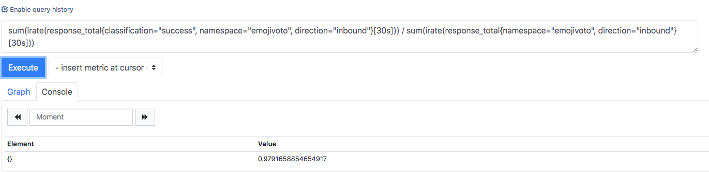

## Summary

This project is a working implementation of a PR proposed to offer a mechanism to configure alerts based on performance metrics exposed by linkerd.

Original PR Link: https://github.com/linkerd/linkerd2/pull/4220

## Getting started 

[daas-linkerd](./daas-linkerd.yaml) is an installation manifest that has been rendered from a binary compiled from this branch. The linkerd control plane, including prometheus and grafana, can be modified by making the desired modifications, and then applying this manifest to the cluster:

```
kubectl apply -f daas-test.yaml
```

### Configuring AlertManager instances

This section has been prepended to the prometheus `ConfigMap` to add alertmanager instances at runtime:

Currently this is configured for http://alertmanager.sre.solidfire.net

```
prometheus.yml: |-
    alerting:
      alertmanagers:
        - scheme: http
          static_configs:
          - targets:
            - alertmanager.sre.solidfire.net
```

### Running a query in Prometheus
For developing new query expressions and alerts, it is very useful to have access to the prometheus UI.

1. Open a tunnel from your client to the prometheus service:
```
kubectl port-forward svc/linkerd-prometheus 9090
$ Forwarding from 127.0.0.1:9090 -> 9090
$ Forwarding from [::1]:9090 -> 9090
```
2. Navigate to the prometheus UI at http://localhost:9090
3. Enter your desired query:



### Configuring Prometheus Alerts

Alerts can be configured in this section of the `ConfigMap`.

In this example, we're configuring an alert to go off when the global success rate for the `emojivoto` namespace falls below 99% for 1 minute.

```
alerting_rules.yml: |-
    groups:
      - name: example
        rules:
        - alert: EmojiVotoSuccessRate
          expr: sum(irate(response_total{classification="success", namespace="emojivoto", direction="inbound"}[30s])) / sum(irate(response_total{namespace="emojivoto", direction="inbound"}[30s])) < 0.99
          for: 1m
          labels:
            severity: page
          annotations:
            summary: < 99% success rate
```

This query expression is replicating this widget on the linkerd grafana dashboard:


**And the source expression for this widget**:
```
"targets": [
        {
          "expr": "sum(irate(response_total{classification=\"success\", namespace=~\"$namespace\", deployment=~\"$deployment\"}[30s])) / sum(irate(response_total{namespace=~\"$namespace\", deployment=~\"$deployment\"}[30s]))",
          "format": "time_series",
          "intervalFactor": 1,
          "legendFormat": "",
          "refId": "A"
        }
      ],
      "thresholds": ".9,.99",
      "title": "GLOBAL SUCCESS RATE",
      "type": "singlestat",
      "valueFontSize": "80%",
```

### Viewing Triggered Alerts
Navigating to our configured Alertmanager instance at http://alertmanager.sre.solidfire.net, we can see the alert has triggered:

